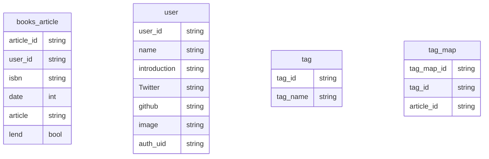

# team-l

## client
- http://localhost:3000
#### ドメイン

- 書籍一覧ページ : /home 
- 書籍詳細ページ : /books/{book-id}
- サインインページ : /sign-in
- サインアップページ : /sign-up
- プロフィール(本棚)ページ : /{user-name}
- DM一覧 : /dm
- DM : /dm/{user-name} - {username}

## api-server
- http://localhost:8080

## DB(MySQL)

