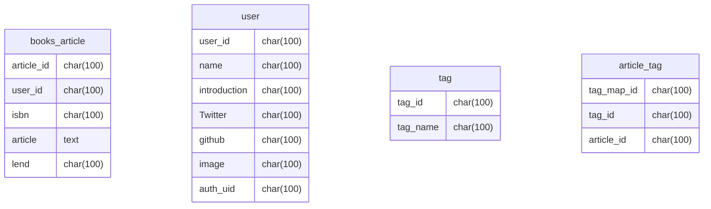

# team-l

## 立ち上げ
全体: ```docker-compose up```
フロント: ```yarn dev```
apiサーバ: ```go run server.go```

## client
- http://localhost:3000
#### ドメイン

- 書籍一覧ページ : /home 
- 書籍詳細ページ : /books/{book-id}
- サインインページ : /sign-in
- サインアップページ : /sign-up
- プロフィール(本棚)ページ : /{user-name}

## api-server
- http://localhost:8080

#### ドメイン

- エンドポイント : /

ユーザ関連
- ユーザー詳細情報取得(GET) : /user/:id
```
{
  userName: "fukke0906",
  userId: "000",
  signUpDate: "20220314",
  introduction: "hello! I'm fuke kazuki!!",
  image: "hoge,png",
  twitter: "@fukke0906",
  github: "FukeKazki",
  postList: [
    {
      article_id: "00000",
      isbn: "0000000000000",
      name: "bookA",
      author: "kosen taro",
      postUserId: "000",
      posrUserName: "fukke0906",
      publicationDate: "20001010",
      article: "めっちゃいい",
      lend: true,
      techTag:[
        "JavaScript",
        "Node.js",
        "Express"
      ]
    }
  ]
}
```
- ユーザ登録(POST) : /user/:id
- ユーザ情報更新(PUT) : /user/:id

投稿関連
- 投稿一覧取得(GET) : /books
```
{
  article_id: "00000",
  isbn: "0000000000000",
  name: "bookA",
  author: "kosen taro",
  postUserId: "000",
  posrUserName: "fukke0906",
  publicationDate: "20001010",
  article: "めっちゃいい",
  lend: true,
  techTag:[
    "JavaScript",
    "Node.js",
    "Express"
  ]
},
{
  article_id: "00001",
  isbn: "0000000000001",
  name: "bookB",
  author: "kosen taro",
  postUserId: "001",
  posrUserName: "fukke0906",
  publicationDate: "20001010",
  article: "めっちゃいい, sugeeee",
  lend: true,
  techTag:[
    "JavaScript",
    "Node.js",
    "Express",
    "Go"
  ]
}
```
- 投稿詳細取得(GET) : /books/:id
```
{
  article_id: "00000",
  isbn: "0000000000000",
  name: "bookA",
  author: "kosen taro",
  postUserId: "000",
  posrUserName: "fukke0906",
  publicationDate: "20001010",
  article: "めっちゃいい",
  lend: true,
  techTag:[
    "JavaScript",
    "Node.js",
    "Express"
  ]
}
```
- 投稿(POST) : /books/:id
```
{
  userId: string,
  isbn: string,
  article: string,
  lend: boolean
}
```
- 投稿修正(PUT) : /books/:id
- 投稿削除(DELETE) : /books/:id


## DB(MySQL)


