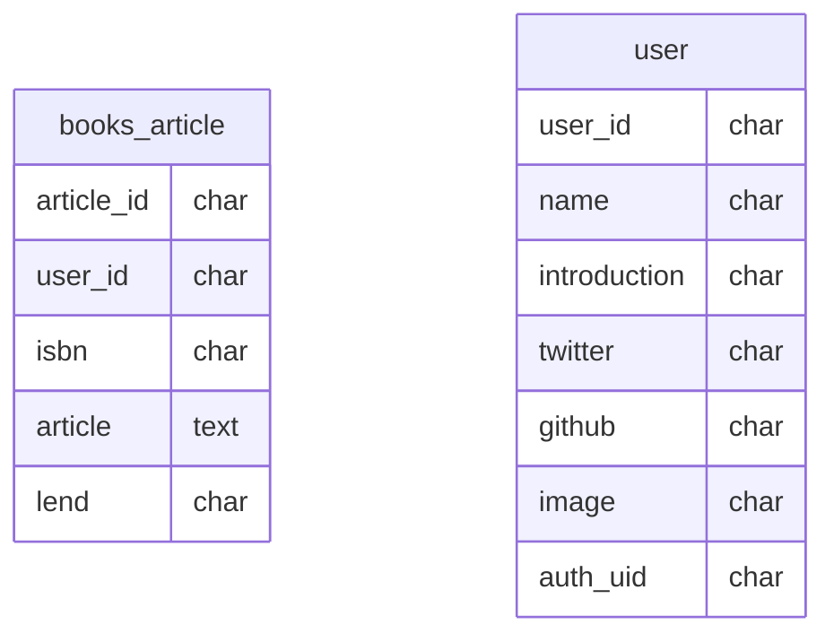

# team-了解(ハックツハッカソンギガノト杯)

## client
- http://localhost:3000
#### ドメイン

- 書籍一覧ページ : /home 
- 書籍詳細ページ : /books/{book-id}
- サインアップページ
- プロフィール(本棚)ページ : /{user-name}

## api-server
- http://localhost:8080

#### ドメイン

- エンドポイント : /

ユーザ関連
- ユーザー詳細情報取得(GET) : /user/:id
```
{
    "userId": "c8o18gu49b3hs0ma51cg",
    "name": "fukke",
    "introduction": "ふけけけけけけ",
    "image": "idenfukke.png",
    "twitter": "@fukeeeeeeeeee",
    "Github": "nyannnyannnnn",
    "ArticleList": [
        {
            "articleId": "c8o19de49b3hs0ma51d0",
            "isbn": "9784295000969",
            "article": "fukefukefukkkeeee!!!!!!!",
            "lend": false,
            "bookData": {
                "isbn": "9784295000969",
                "title": "Goプログラミング実践入門",
                "publisher": "インプレス",
                "pubdate": "2017-03",
                "cover": "",
                "author": "Chang,SauSheong／著 上西昌弘／翻訳 武舎広幸／翻訳 鄭兆雄／著 阿部和也／翻訳 ほか"
            }
        },
        {
            "articleId": "c8o21de49b3i15qvhme0",
            "isbn": "481561072X",
            "article": "わかりやすみ!",
            "lend": false,
            "bookData": {
                "isbn": "9784815610722",
                "title": "モダンJavaScriptの基本から始める　React実践の教科書",
                "publisher": "ＳＢクリエイティブ",
                "pubdate": "20210918",
                "cover": "https://cover.openbd.jp/9784815610722.jpg",
                "author": "じゃけぇ（岡田拓巳）／著"
            }
        }
    ]
}
```
- ユーザ登録(POST) : /user
```
//body
{
    "userName": "fukke",
    "introduction": "ふけけけけけけ",
    "image": "idenfukke.png",
    "twitter": "@fukeeeeeeeeee",
    "github": "nyannnyannnnn"
}
```
- ユーザ情報更新(PUT) : /user/:id　未実装(putの際にDELETE処理で対応)

投稿関連
- 投稿一覧取得(GET) : /books 未実装
```
[
    {
      article_id: "00000",
      isbn: "0000000000000",
      name: "bookA",
      author: "kosen taro",
      postUserId: "000",
      posrUserName: "fukke0906",
      publicationDate: "20001010",
      article: "めっちゃいい",
      lend: true
    },
    {
      article_id: "00001",
      isbn: "0000000000001",
      name: "bookB",
      author: "kosen taro",
      postUserId: "001",
      posrUserName: "fukke0906",
      publicationDate: "20001010",
      article: "めっちゃいい, sugeeee",
      lend: true
    }
]
```
- 投稿詳細取得(GET) : /books/:article_id
```
{
    "articleId": "c8nvkae49b3her70emfg",
    "userId": "c8nvjkm49b3her70emf0",
    "article": "fukefukefukkkeeee!!!!!!!",
    "lend": false,
    "bookData": {
        "isbn": "9784295000969",
        "title": "Goプログラミング実践入門",
        "publisher": "インプレス",
        "pubdate": "2017-03",
        "cover": "",
        "author": "Chang,SauSheong／著 上西昌弘／翻訳 武舎広幸／翻訳 鄭兆雄／著 阿部和也／翻訳 ほか"
    }
}
```
- 投稿(POST) : /books/:user_id 
```
{
    "articleId": "c8nvkae49b3her70emfg",
    "userId": "c8nvjkm49b3her70emf0",
    "article": "fukefukefukkkeeee!!!!!!!",
    "lend": false,
    "bookData": {
        "isbn": "9784295000969",
        "title": "Goプログラミング実践入門",
        "publisher": "インプレス",
        "pubdate": "2017-03",
        "cover": "",
        "author": "Chang,SauSheong／著 上西昌弘／翻訳 武舎広幸／翻訳 鄭兆雄／著 阿部和也／翻訳 ほか"
    }
}
```
- 投稿修正(PUT) : /books/:id 未実装
- 投稿削除(DELETE) : /books/:id 未実装

## DB(MySQL)



### mysql立ち上げ方法
イメージのビルド
```sh
$ Docker-Compose build
```
docker composeの立ち上げ
```sh
$ Docker-Compose up -d
```
コンテナへのログイン
```sh
$ docker exec -it giganoto-app_mysql_1 bash -p
```
MySQLの起動
```sh
# mysql -u root -p -h 127.0.0.1
```
